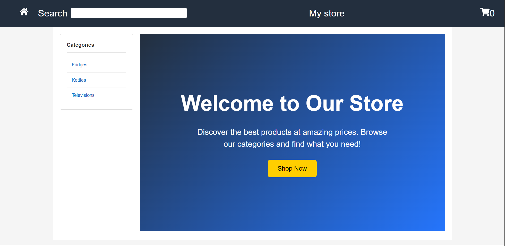
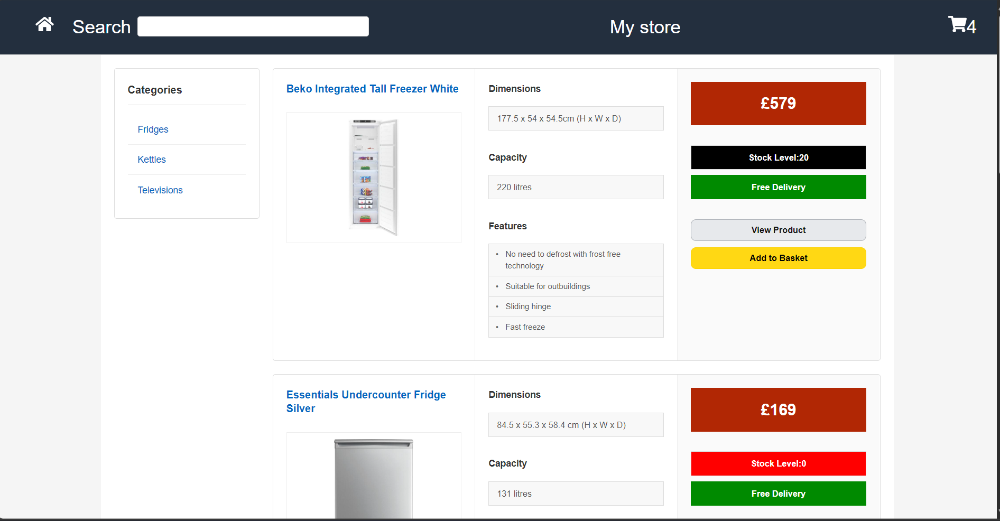
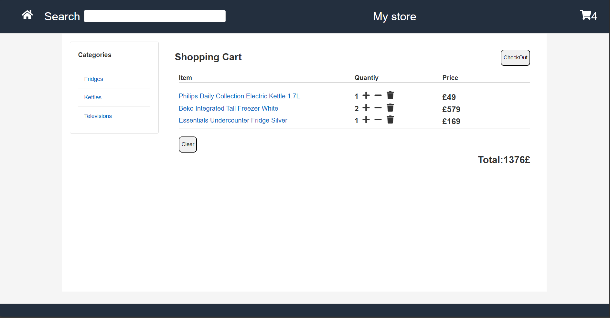
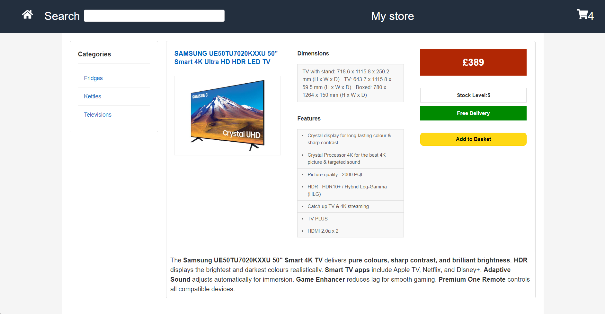
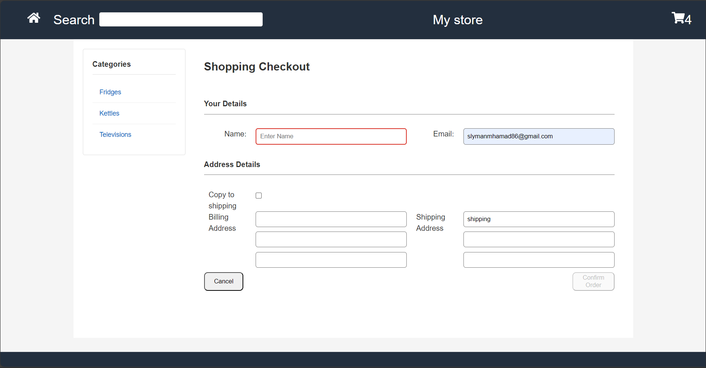
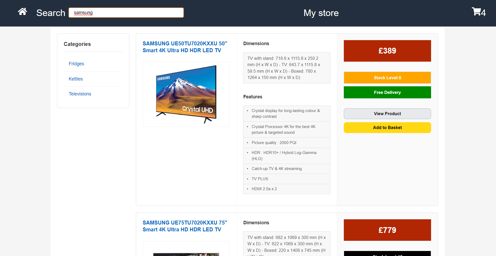

# 🛒 React Ecommerce Store

A modern, responsive ecommerce application built with React, featuring a complete shopping experience with product browsing, cart management, and checkout functionality.


## 📸 Screenshots

### Homepage

*Welcome page with hero section and call-to-action*

### Product Catalog

*Complete product listing with category filtering*

### Shopping Cart

*Shopping cart with quantity management and total calculation*

### Product Details

*Detailed product view with specifications and features*

### Checkout Process

*Checkout form with customer information and address fields*

### Search Results

*Search functionality with filtered product results*

## ✨ Features

### 🏠 **Homepage**
- Modern hero section with call-to-action
- Responsive design with gradient background
- Direct navigation to product catalog

### 🛍️ **Product Management**
- **Product Catalog**: Browse all available products
- **Category Filtering**: Filter products by categories (Fridges, Kettles, Televisions)
- **Product Details**: Detailed product information with specifications and features
- **Search Functionality**: Real-time product search with debounced input
- **Stock Management**: Display stock levels and availability

### 🛒 **Shopping Cart**
- **Add to Cart**: Add products to shopping cart
- **Quantity Management**: Increase/decrease item quantities
- **Remove Items**: Remove individual items from cart
- **Clear Cart**: Clear all items at once
- **Persistent Storage**: Cart data persists using localStorage
- **Real-time Total**: Dynamic price calculation

### 💳 **Checkout Process**
- **Customer Information**: Name and email collection
- **Address Management**: Billing and shipping address forms
- **Form Validation**: Real-time form validation with error handling
- **Order Confirmation**: Order completion confirmation page

### 🎨 **UI/UX Features**
- **Responsive Design**: Mobile-first approach with responsive breakpoints
- **Modern Styling**: Clean, professional design using Styled Components
- **Interactive Elements**: Hover effects and smooth transitions
- **Error Handling**: User-friendly error messages
- **Loading States**: Proper loading indicators

## 🛠️ **Technology Stack**

- **Frontend**: React 19.1.1
- **Build Tool**: Vite 7.1.2
- **Routing**: React Router DOM 6.30.1
- **Styling**: Styled Components 6.1.19
- **Icons**: React Icons 5.5.0
- **State Management**: React Context API + useReducer
- **Data Storage**: JSON Server for mock API
- **Development**: ESLint for code quality

## 📦 **Product Categories**

### 🧊 **Fridges** (5 products)
- Beko Integrated Tall Freezer White - £579
- Essentials Undercounter Fridge Silver - £169
- Kenwood KTLD60X20 Tall Fridge - £449
- BEKO BLSD3577 Integrated Tall Fridge - £449
- ZANUSSI MultiFlow ZRME38FW2 Tall Fridge White - £554

### 📺 **Televisions** (5 products)
- Samsung UE50TU7020KXXU 50" Smart 4K TV - £389
- LG 32LM6370PLA 32" Smart Full HD TV - £249
- Panasonic TX40JX800B 40" Smart 4K TV - £399
- Panasonic TX48JZ1000B 48" Smart 4K OLED TV - £399
- Samsung UE75TU7020KXXU 75" Smart 4K TV - £779

### 🫖 **Kettles** (3 products)
- Philips Daily Collection Electric Kettle 1.7L - £49
- Russell Hobbs Retro Kettle 1.5L - £59
- Breville Crystal Clear Glass Kettle 1.7L - £69

## 🚀 **Getting Started**

### Prerequisites
- Node.js (version 14 or higher)
- npm or yarn package manager

### Installation

1. **Clone the repository**
   ```bash
   git clone https://github.com/MHMD304/ecommerce_site_in_react.git
   cd ecommerce_site_in_react
   ```

2. **Install dependencies**
   ```bash
   npm install
   ```

3. **Start the JSON Server** (in a separate terminal)
   ```bash
   npx json-server --watch db.json --port 3000
   ```

4. **Start the development server**
   ```bash
   npm run dev
   ```

5. **Open your browser**
   Navigate to `http://localhost:5173` to view the application

### Available Scripts

- `npm run dev` - Start development server
- `npm run build` - Build for production
- `npm run preview` - Preview production build
- `npm run lint` - Run ESLint

## 📁 **Project Structure**

```
ecommerce_site_in_react/
├── public/
│   └── assets/                 # Product images
├── src/
│   ├── components/            # React components
│   │   ├── Basket.jsx         # Shopping cart component
│   │   ├── Category.jsx       # Category view
│   │   ├── CategoryProduct.jsx # Product card component
│   │   ├── Checkout.jsx       # Checkout form
│   │   ├── Home.jsx           # Homepage
│   │   ├── Layout.jsx         # Main layout wrapper
│   │   ├── OrderConfirmation.jsx # Order success page
│   │   ├── ProductDetails.jsx # Product detail view
│   │   ├── Products.jsx       # Product catalog
│   │   ├── Search.jsx         # Search component
│   │   └── SearchResults.jsx  # Search results
│   ├── contexts/              # React Context
│   │   ├── CartContext.jsx    # Cart state management
│   │   └── CartReducer.jsx    # Cart actions reducer
│   ├── db/
│   │   └── db.json            # Mock database
│   ├── App.jsx                # Main app component
│   ├── App.css                # Global styles
│   ├── fetcher.js             # API utility functions
│   └── main.jsx               # App entry point
├── db.json                    # JSON Server database
├── package.json               # Dependencies and scripts
└── README.md                  # Project documentation
```

## 🔧 **Configuration**

### JSON Server
The application uses JSON Server to simulate a REST API. The server runs on `http://localhost:3000` and serves the product data from `db.json`.

### Environment Variables
No environment variables are required for basic functionality. The API base URL is configured in `src/fetcher.js`.

## 🎯 **Key Features Implementation**

### State Management
- Uses React Context API for global state management
- Cart state managed with useReducer for complex state updates
- Local storage integration for cart persistence

### Routing
- React Router DOM for client-side routing
- Protected routes and navigation guards
- Dynamic routing for products and categories

### Responsive Design
- Mobile-first CSS approach
- Styled Components for component-scoped styling
- Flexible grid layouts for different screen sizes

## 🚀 **Deployment**


## 🤝 **Contributing**

1. Fork the repository
2. Create a feature branch: `git checkout -b feature-name`
3. Commit changes: `git commit -m 'Add feature'`
4. Push to branch: `git push origin feature-name`
5. Submit a pull request

## 📝 **License**

This project is licensed under the MIT License - see the [LICENSE](LICENSE) file for details.

## 👨‍💻 **Author**

Created by [Mohammad Al Soliman](https://github.com/MHMD304)

## 🙏 **Acknowledgments**

- React team for the amazing framework
- Styled Components for elegant styling solution
- React Router team for seamless routing
- JSON Server for easy API mocking

---

**Happy Shopping! 🛒✨**
